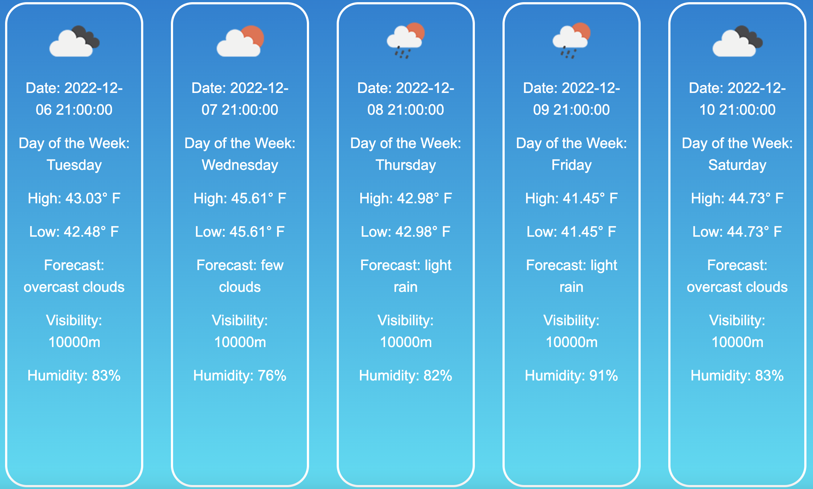

# Weather App

A 5-day weather forecast web application built with PHP and JavaScript. Users can search any location and get a detailed forecast pulled from a weather REST API.



## Features

- Search weather by city name
- Displays 5-day forecast with temperature and conditions
- REST API integration for live weather data
- SQLite database integration via phpLiteAdmin
- Clean, responsive UI

## Tech Stack

- **Backend:** PHP (REST server, class-based architecture)
- **Frontend:** HTML, CSS, JavaScript
- **Database:** SQLite via phpLiteAdmin
- **API:** OpenWeatherMap (weather REST API)

## Setup

**Requirements:** PHP 7+, a web server (Apache/Nginx or PHP's built-in server)

```bash
# Clone the repository
git clone https://github.com/rfisch26/weatherApp.git
cd weatherApp

# Start PHP's built-in server
php -S localhost:8000

# Open in browser
open http://localhost:8000/homepage.html
```

## Project Structure

```
weatherApp/
├── homepage.html       # Landing page
├── weather.html        # Forecast results page
├── final.php           # Main API handler
├── final.class.php     # Weather data class
├── RestServer.php      # REST server implementation
├── weather.js          # Frontend fetch logic
├── weather.css         # Forecast page styles
└── homepage.css        # Landing page styles
```
